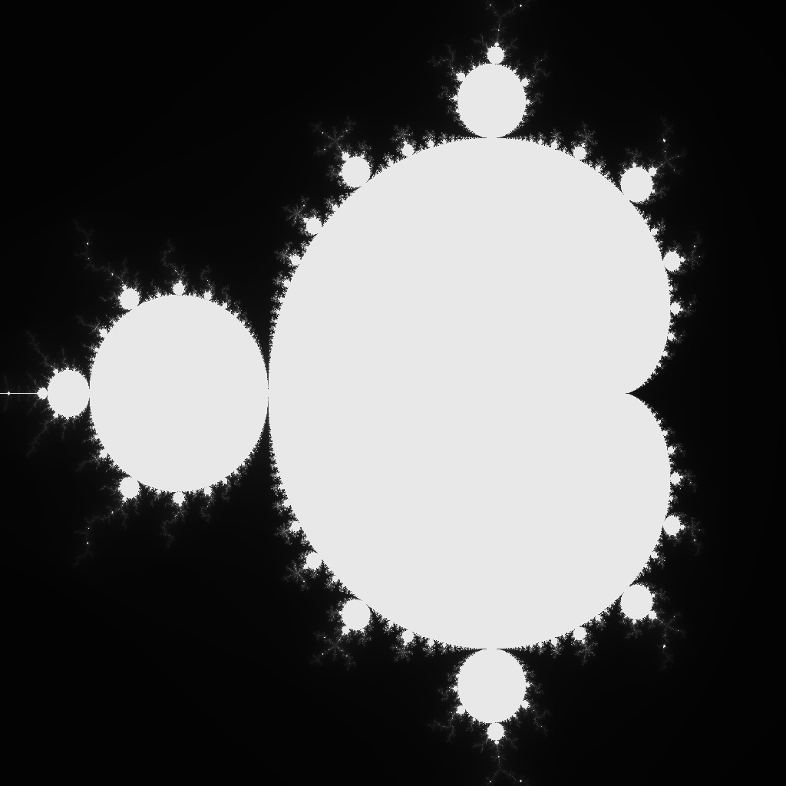

# Mandelbrot set visualization

## Theory
### Definition
The Mandelbrot set is the set of complex numbers $c$ for which the function $f_c(z) = z^2 + c$ does not diverge to infinity when iterated from $z = 0$, i.e., for which the sequence $f_c(0)$, $f_c(f_c(0))$ , etc., remains bounded in absolute value.

### Algorithm
The algorithm is based on the function 

```c
int mandelbrot(...)
```

 which returns the number of iterations it takes to reach the critical "escape" condition. Thus, this function is run for each pixel of the image and, depending on the result of the function, each pixel is colored in shades of gray.


## Installation and usage

### Installation
```sh
git clone https://github.com/amamdemous/mandelbrot_set
cd mandelbrot_set/
make
```

### Usage
Run the executable with width, height and maximum number of iterations.

Example:
``` sh
./mandelbrot 1024 1024 1000
```
For the sake of simplicity output image is in .ppm format which can be viewed through most image viewers

## Reference
- https://en.wikipedia.org/wiki/Plotting_algorithms_for_the_Mandelbrot_set
- https://en.wikipedia.org/wiki/Mandelbrot_set
-  There is a good video on [3Blue1Brown](https://youtu.be/LqbZpur38nw)'s channel
- [Numberphile](https://youtu.be/NGMRB4O922I) 's video
- [PPM image format specification](http://netpbm.sourceforge.net/doc/ppm.html)
